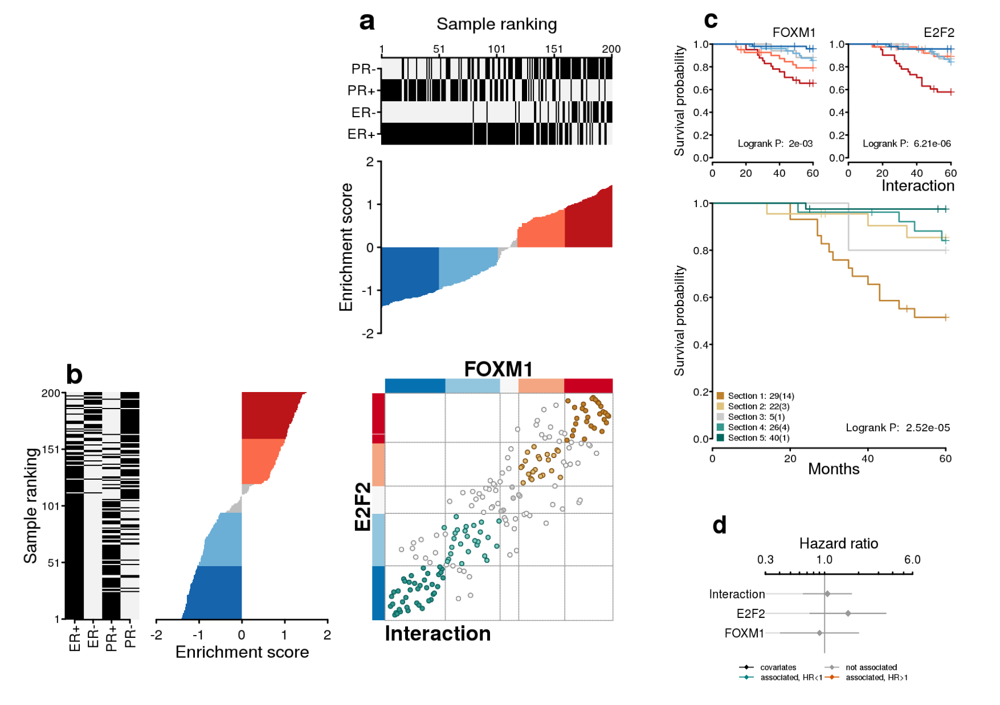

# Overview

Transcriptional networks are important tools to visualize complex biological systems that involve large groups of genes and multiple regulators. In a previous study, we have implemented the **RTN** R/Bioconductor package to reconstruct transcriptional regulatory networks [@Fletcher2013]. It reconstructs regulons, consisting of a regulator and its target genes. A regulon can be further analyzed to investigate, for example, the association of its expression on survival probabilities.

**RTNsurvival** is a tool for integrating regulons generated by the **RTN** package with survival information for the same set of samples (i.e. a cohort). It visualizes the integrated data using 2-tailed Gene Set Enrichment Analysis (GSEA2) approach and survival plots [@Castro2016]. This package is implemented using S4 classes and methods for plots and analyses. There are two main survival analyses generated by **RTNsurvival**: a Cox Proportional Hazards approach used to model regulons as predictors of survival time (**Figure 1**), and a Kaplan-Meier analysis showing the stratification of a cohort based on the regulon activity (**Figure 2**). For a given regulon, the 2-tailed GSEA approach computes a differential Enrichment Score (dES) for each individual sample, and the dES distribution of all samples is then used to assess the survival statistics for the cohort. The plots can be fine-tuned to the user's specifications.

# Quick Start

## Create a TNI object

**RTNsurvival** uses the RTN package data, which provides a precomputed regulon.

```{r}
library(RTN)
data(stni, package="RTN")
stni <- upgradeTNI(stni)
```

This data object is a `TNI-class` created from a subset of the expression matrix in the `Fletcher2013b` package. The TNI object contains a minimal toy reconstruction of 5 regulons (PGR, MYB, E2F2, FOXM1 and PTTG1).

More information about the reconstruction of the toy regulons can be viewed by calling the summary of the TNI object. 

```{r}
summary <- tni.get(stni, what = "summary")

```

## Load survival data
The package provides a sample survival table of clinical data from the METABRIC study [@Curtis2012] where the expression data for the `TNI` was obtained.

```{r}
library(RTNsurvival)
data(survival.data)
```

## Create a TNS object
The `TNS` object can be created using the `tnsPreprocess` method. A survival table must be provided with time and event columns. A `TNI` object must also be provided. Key covariates can also be specified and used to compute the Cox analysis.

```{r}
rtns <- tnsPreprocess(stni, survival.data, keycovar = c("Grade","Age"), time = 1, event = 2)
```

## Run the 2-tailed GSEA for all individual samples in a cohort

All survival analyses depend on the 2-tailed GSEA, which generates the differential Enrichment Scores (dES) for all samples and regulons. The `tnsGSEA2` function calls the `tni.gsea2` method available in the RTN package.

```{r}
rtns <- tnsGSEA2(rtns, verbose = FALSE)
```

## Run the Cox analysis

Once the dES metric has been computed by `tnsGSEA2` function, then it is possible to run the survival panel and Cox analysis. 

The `tnsCox` method runs a Cox multivariate regression analysis and shows the proportional hazards of each of the specified regulons and the provided key covariates, indicating the contribution of each variable to survival (**Figure 1**). The method uses the Bioconductor survival package to fit the Cox model.

```{r, fig.height=5, fig.width=5}
tnsCox(rtns, sortregs = TRUE, plotpdf = FALSE)
```


<b>Figure 1</b> - The plot shows the Hazard Ratio for all key covariates and regulons. Lines that are completely to the right of the grey line, shown in red, are positively associated with hazard. This means that samples with high expression of this regulon have poor prognostic. The further to the right or left of the grey line, the more significant is the association.

## Run the Kaplan-Meier analysis

The `tnsKM` method generates a Kaplan-Meier plot, which consists of three panels put together: a ranked dES plot for the cohort, a status of key attributes plot (optional) and a Kaplan-Meier plot, showing curves for lower and higher dES samples (**Figure 2**).

```{r, fig.height=3.6, fig.width=6.3}
tnsKM(rtns, regs="FOXM1", attribs = list(c("ER+","ER-"),c("PR+","PR-"),c("G1","G2","G3"),"HT"), 
endpoint=180, plotpdf = FALSE)
```

<b>Figure 2</b> - The Kaplan-Meier plot for FOXM1 shows that samples with high expression of the genes (red and pink) in this regulon have poorer prognostic than those with low expression, as their survival probability is lower than the samples that have low expression of this regulon (in light and dark blue).

## Plot the 2-tailed GSEA for a given sample

Individual sample differential enrichment analysis can be investigated using the `tnsPlotGSEA2` function. This will generate a 2-tailed GSEA plot for the differential expression of both positive and negative targets of the regulon (**Figure 3**). This step takes a little longer because the GSEA is recomputed for a selected regulon, and because `tnsPlotGSEA2` is a wrapper for the **RTN** function `tna.plot.gsea2`, which generates the GSEA plot.

```{r, fig.height=5, fig.width=4.7}
tnsPlotGSEA2(rtns, "MB-5115", regs = "FOXM1", verbose = FALSE, plotpdf = FALSE)
```

<b>Figure 3</b> - The 2-tailed GSEA plot for the MB-5116 sample. It shows that the positive targets of the FOXM1 regulator are positively enriched, while the negative targets are negatively enriched. 

## Plot the Differential Enrichment Scores for all regulons and all samples

An overview of the differential enrichment scores (dES) can be obtained by plotting a heatmap with all evaluated samples and regulons. First, we need to obtain the matrix of dES from the TNS object. Then, we can plot the heatmap using the `pheatmap` function from the **pheatmap** package. In this example, we also illustrate how to incorporate sample features from the survival data.

```{r}
enrichmentScores <- tnsGet(rtns, "EScores")
survival.data <- tnsGet(rtns, "survivalData")
annotationBars <- survival.data[,c("ER+", "ER-")]
pheatmap::pheatmap(t(enrichmentScores$dif),
                   annotation_col = annotationBars,
                   main = "Differential Enrichment Scores (dES) for GEXP samples",
                   show_colnames = FALSE,
                   annotation_legend = FALSE)

```

<b>Figure 4</b> - Differential Enrichment Scores for GEXP samples. This heatmap shows two main regulon clusters. The PGR and MYB regulons are repressed in the ER- samples and activated in ER+ samples. The PTTG1, E2F2 and FOXM1 regulons, on the other hand, are activated in ER- samples and repressed in ER+ samples. 

## Evaluating survival in dual regulons
Integrating data from different regulons may be of interest, especially if they come from different regulatory
networks made for the same expression matrix. Concepts from the **RTNduals** package can be used to compute
dual regulons, which are regulon pairs whose common targets are likely to be affected by both regulators.

The workflow of RTNduals can be used to infer dual TF-TF regulons, using the `TNI` from the example, for 
demonstration purposes only.

```{r}
library(RTNduals)
smbr <- tni2mbrPreprocess(stni, stni, verbose = FALSE)
smbr <- mbrAssociation(smbr, prob = 0.75, verbose = FALSE)
smbr <- mbrDuals(smbr, verbose = FALSE)
mbrGet(smbr, "dualsInformation")
```

The `smbr` is an object of `MBR-class`, containing the motifs between the regulons represented in
the `stni` network. As `prob` was set to 75%, only the 25% most significant inferred duals are shown
in the results.

Now, since the `stns` object and `smbr` object were computed from the same expression matrix,
we can use the survival information for that cohort in conjunction with the duals information.

```{r, eval = FALSE}
duals <- mbrGet(smbr, what="dualRegulons")
dualSurvivalPanel(smbr, rtns, dual = duals[1], 
                  attribs = c("ER+", "ER-", "PR+", "PR-"))
```

The `dualsSurvivalPanel` method generated a directory containing six plots:
<ol>

<li> a sample stratification for regulon 1 of the dual, with sample attributes;</li>
<li> a sample stratification for regulon 2 of the dual, with the same attributes;</li>
<li> an interaction scatter plot of the samples, where x and y represent that sample's position in the stratifications;</li>
<li> Kaplan-Meier curves for both regulons, using their stratifications, and for the interaction between them, with the selected samples;</li>
<li> a Cox regression plot, showing the association of both regulon activities with risk, as well as the association of the interaction; and</li>
<li> a panel plot which contains all of these plots in a suggested panel, which is shown in Figure 5.
</ol>



<b>Figure 5</b> - Dual Survival Plot for FOXM1~E2F2 dual regulon. It shows the activity in the samples is positively correlated, but there is no additional hazard ratio information given by the Cox regression of the interaction. **a)** Sample ranking using differential Enrichment Score (dES) of regulon FOXM1. **b)** dES sample ranking for regulon E2F2 and a sample scatter plot, showing the ranking of each sample in both regulons. In this case, FOXM1 and E2F2 agree in sample stratification. **c)** Kaplan-Meier curves. The Interaction curve follows the individual regulons very closely. **d)** Cox regression plot. It doesn't show any association between the activity of these regulons or interaction and hazard ratio.


## Session Info
```{r}
sessionInfo()
```

## References

