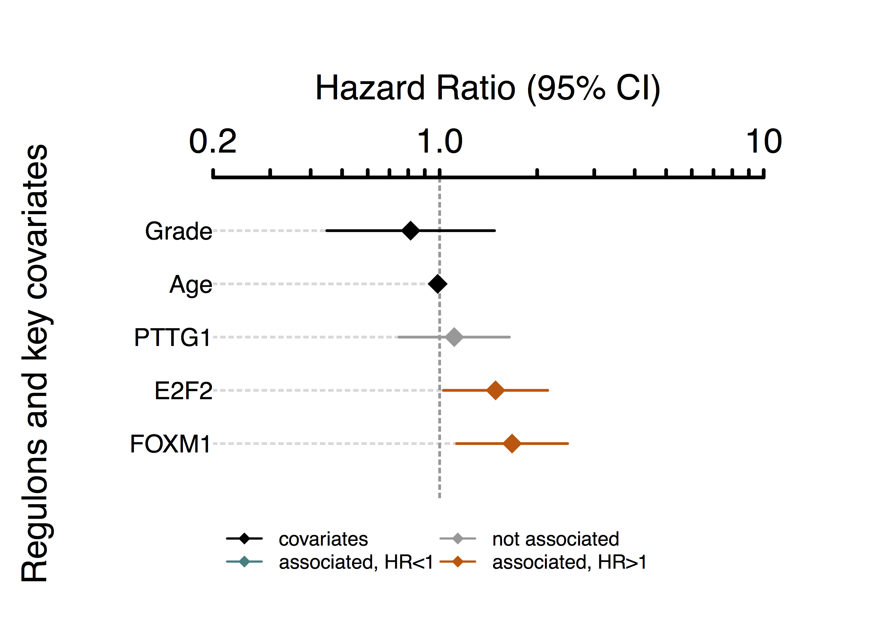
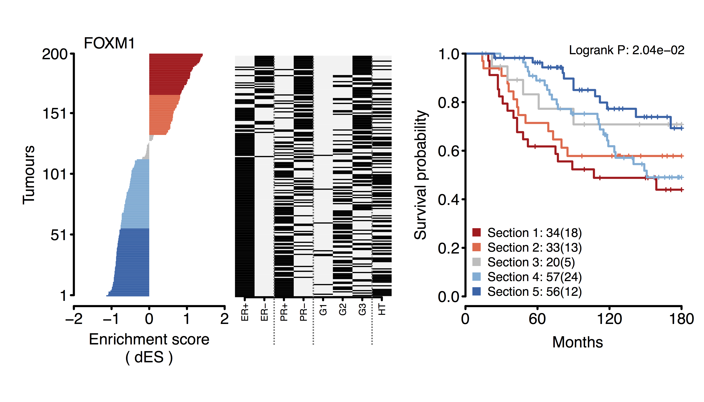
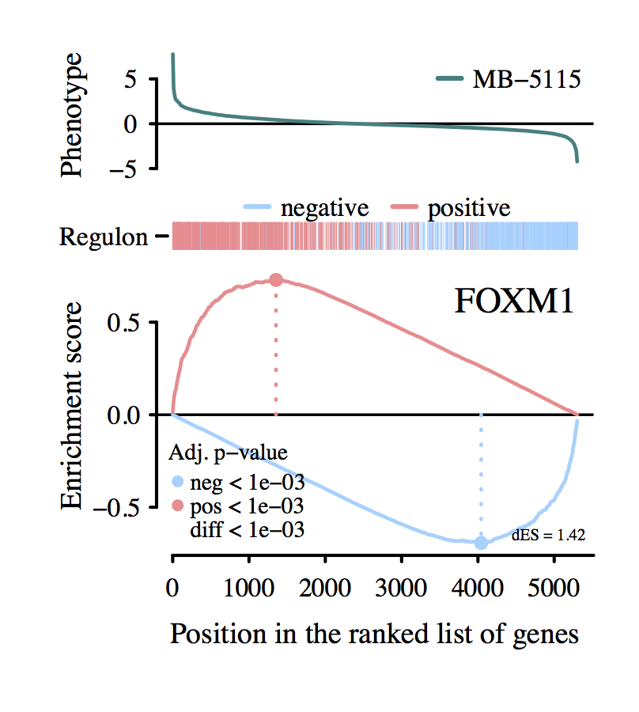
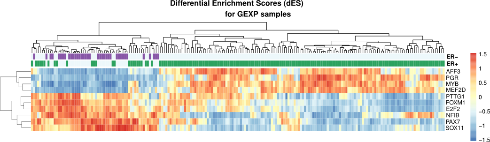

# Overview

Transcriptional networks are important tools to visualize complex biological systems that involve large groups of genes and multiple regulators. In a previous study we have implemented the **RTN** R/Bioconductor package to reconstruct transcriptional regulatory networks [@Fletcher2013]. It reconstructs regulons, consisting of a regulator and its target genes. A regulon can be further analyzed to investigate, for example, the association of its expression on survival probabilities.

**RTNsurvival** is a tool for integrating regulons generated by the **RTN** package with survival information for the same set of samples (i.e. a cohort). It visualizes the integrated data using 2-tailed Gene Set Enrichment Analysis (GSEA2) approach and survival plots [@Castro2016]. This package is implemented using S4 classes and methods for plots and analyses. There are two main survival analyses generated by **RTNsurvival**: a Cox Proportional Hazards approach used to model regulons as predictors of survival time (**Figure 1**), and a Kaplan-Meier analysis showing the stratification of a cohort based on the regulon activity (**Figure 2**). For a given regulon, the 2-tailed GSEA approach computes a differential Enrichment Score (dES) for each individual sample, and the dES distribution of all samples is then used to assess the survival statistics for the cohort. The plots can be fine tuned to the user's specifications.

# Quick Start

## Create a TNI object

**RTNsurvival** uses the RTN package data to compute a `TNI-class` object. 

```
data(dt4rtn, package="RTN")
```

This data object is a list which contains an expression matrix (`dt4rtn$gexp`), an annotation data.frame for the genes (`dt4rtn$gexpIDs`),
a differential expression vector (`dt4rtn@pheno`) and annotation table (`dt4rtn$phenoIDs`), a vector with differentially expressed genes (`dt4rtn$hits`) and a vector listing transcription factors (`tfs`). Only the gexp, gexpIDs and tfs are required in this instance to create a `TNI-class` object. The example `TNI` will contain three regulons, reconstructed using the regulators FOXM1, E2F2 and PTTG.

```
rtni <- new("TNI", gexp=dt4rtn$gexp, transcriptionFactors=dt4rtn$tfs[c("FOXM1","E2F2","PTTG1")])
rtni <- tni.preprocess(rtni,gexpIDs=dt4rtn$gexpIDs, verbose=FALSE)
rtni<-tni.permutation(rtni, nPermutations=100, verbose=FALSE) #sets 'nPermutations'>=1000
rtni<-tni.dpi.filter(rtni, verbose=FALSE)
```

## Load survival data
The package provides a sample survival table of clinical data from the METABRIC study [@Curtis2012] where the expression data for the `TNI` was obtained.

```
data(survival.data)
```

## Create a TNS object
The `TNS` object can be created using the `tnsPreprocess` method. A survival table must be provided with time and event columns. A `TNI` object must also be provided. Key covariates can also be specified and used to compute the Cox analysis.

```
rtns <- tnsPreprocess(rtni, survival.data, keycovar = c("Grade","Age"), time = 1, event = 2)
```

## Run the 2-tailed GSEA for all individual samples in a cohort

All survival analyses depend on the 2-tailed GSEA, which generates the differential Enrichment Scores (dES) for all samples and regulons. The `tnsGSEA2` function calls the `tni.gsea2` method available in the RTN package.

```
rtns <- tnsGSEA2(rtns, verbose=FALSE)
```

## Run the Cox analysis

Once the dES metric has been computed by `tnsGSEA2` function, then it is possible to run the survival panel and Cox analysis.

```
tnsCox(rtns, regs = c("PTTG1","E2F2","FOXM1"), sortregs = TRUE, plotpdf = FALSE)
```

The `tnsCox` method runs a Cox multivariate regression analysis and shows the proportional hazards of each of the specified regulons and the provided key covariates, indicating the contribution of each variable to survival (**Figure 1**). The method uses the Bioconductor survival package to fit the Cox model.


<legend><b>Figure 1</b> - The plot shows the Hazard Ratio for all key covariates and regulons. Lines that are completely to the right of the dashed line, shown in red, are positively associated with hazard. This means that samples with high expression of this regulon have poor prognostic. The further to the right or left of the dashed line, the more significant is the association.</legend>

## Run the Kaplan-Meier analysis

The `tnsKM` method generates a Kaplan-Meier plot, which consists of three panels put together: a ranked dES plot for the cohort, a status of key attributes plot (optional) and a Kaplan-Meier plot, showing curves for lower and higher dES samples (**Figure 2**).

```
tnsKM(rtns, regs="FOXM1", attribs = list(c("ER+","ER-"),c("PR+","PR-"),c("G1","G2","G3"),"HT"), 
endpoint=180, plotpdf = FALSE)
```


<legend><b>Figure 2</b> - The Kaplan-Meier plot for FOXM1 shows that samples with high expression of the genes (red and pink) in this regulon have poorer prognostic than those with low expression, as their survival probability is lower than the samples that have low expression of this regulon (in light and dark blue).</legend>

## Plot the 2-tailed GSEA for a given sample

Individual sample differential enrichment analysis can be investigated using the `tnsPlotGSEA2` function. This will generate a 2-tailed GSEA plot for the differential expression of both positive and negative targets of the regulon (**Figure 3**). This step takes a little longer because the GSEA is recomputed for a selected regulon, and becouse the `tnsPlotGSEA2` is a wrapper for the **RTN** function called `tna.plot.gsea2`, which generates the GSEA plot.

```
tnsPlotGSEA2(rtns, "MB-5115", regs = "FOXM1")
```


<legend><b>Figure 3</b> - The 2-tailed GSEA plot for the MB-5116 sample. It shows that the positive targets of the FOXM1 regulator are positively enriched, while the negative targets are negatively enriched. </legend>

## Plot the Differential Enrichment Scores for all regulons and all samples

An overview of the differential enrichment scores (dES) can be obtained by plotting
a heatmap with all evaluated samples and regulons. First, we need to obtain the matrix of dES from the TNS object. Then, we can plot the heatmap using the `pheatmap` function from the **pheatmap** package. In this example, we also illustrate how to incorporate sample features from the survival data.

```
data(dt4rtn, package="RTN")
data(survival.data)

rtni <- new("TNI", gexp=dt4rtn$gexp, 
            transcriptionFactors=dt4rtn$tfs[c("PGR","PAX7","AFF3",
                                              "MYB","SOX11","NFIB",
                                              "MEF2D","FOXM1","E2F2","PTTG1")])
rtni <- tni.preprocess(rtni,gexpIDs=dt4rtn$gexpIDs, verbose=FALSE)
rtni<-tni.permutation(rtni, nPermutations=100, verbose=FALSE) #sets 'nPermutations'>=100
rtni<-tni.dpi.filter(rtni, verbose=FALSE)

rtns <- tnsPreprocess(rtni, survival.data, keycovar = c("Grade","Age"), 
                      time = 1, event = 2)
rtns <- tnsGSEA2(rtns, verbose=FALSE)

enrichmentScores <- tnsGet(rtns, "EScores")
survival.data <- tnsGet(rtns, "survivalData")
annotationBars <- survival.data[,c("ER+", "ER-")]
pheatmap::pheatmap(t(enrichmentScores$dif),
                   annotation_col = annotationBars,
                   main = "Differential Enrichment Scores (dES) 
                   for GEXP samples",
                   show_colnames = FALSE,
                   annotation_legend = FALSE)

```

<legend><b>Figure 4</b> - Differential Enrichment Scores for GEXP samples. This heatmap shows two main regulon clusters. The AFF3, PGR, MYB and MEF2D regulons have low expression for the ER- samples and high expression for the ER+ samples. The PTTG1, FOXM1, E2F2, NFIB, PAX7 and SOX11 regulons, on the other hand, have high expression in ER- samples and low expression in ER+ samples. </legend>

## Session Info
```{r}
sessionInfo()
```

## References

